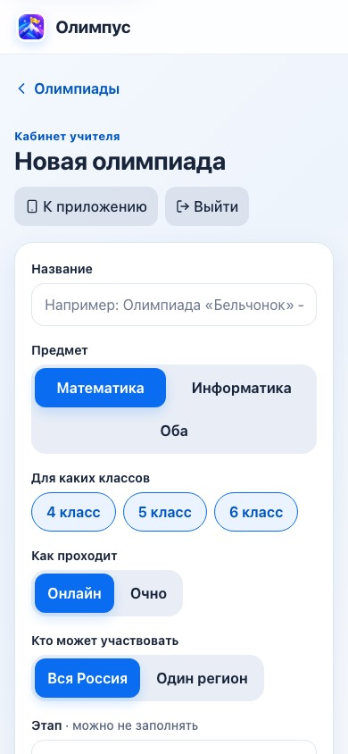
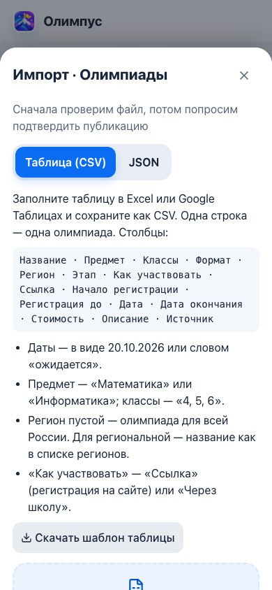

# Кабинет учителя: как вести материалы Олимпуса

Это руководство для учителя или администратора, который наполняет Олимпус: добавляет олимпиады в календарь, пишет темы, уроки, задания и пробники. Программировать не нужно – всё делается в формах внутри приложения.

Что важно знать заранее:

- **Кабинет один на всех.** Вход – по одному общему паролю учителя. Любая опубликованная правка сразу видна **всем** детям.
- **Черновик видите только вы.** Дети видят материал только после кнопки «Опубликовать».
- **Ничего не пропадает насовсем.** Предыдущие версии хранятся в истории, удалённое лежит в корзине, достижения детей при удалении материала сохраняются.

Как этим пользуются дети – в [USER-GUIDE.md](USER-GUIDE.md). Как устроено хранение данных – в [DATA.md](DATA.md).

## Шпаргалка

| Что сделать | Где |
|---|---|
| Войти | раздел «Я» → в самом низу «Для учителя» → пароль → «Войти» |
| Выбрать тип материалов | переключатель «Олимпиады · Темы · Уроки · Задания · Пробники» |
| Добавить материал | «Добавить олимпиаду» (тему, урок, задание, пробник) |
| Исправить материал | «Изменить» в строке материала |
| Проверить, как увидят дети | «Как увидят дети» в форме |
| Спрятать правку до готовности | «Сохранить черновик» |
| Показать детям | «Опубликовать» |
| Вернуть старую версию | значок часов в строке → «История изменений» → «Восстановить» |
| Удалить | значок корзины в строке → «Удалить» |
| Вернуть удалённое | «Корзина» → «Вернуть» → «Восстановить» → открыть и «Опубликовать» |
| Загрузить много олимпиад | «Импорт из файла» → «Таблица (CSV)» |
| Загрузить много тем, уроков, заданий | «Импорт из файла» → JSON |
| Сохранить копию раздела себе | «Скачать JSON» |
| Выйти | «Выйти» в шапке кабинета |

## 1. Вход в кабинет

### Где найти

1. Откройте Олимпус: в MAX (кнопка «Открыть Олимпус» в чате с ботом) или в браузере по адресу сайта. Рабочий адрес – https://olympus-edu.ru.
2. Откройте раздел **«Я»**: на телефоне он внизу экрана, на широком экране – в меню разделов.
3. Пролистайте в самый низ и нажмите **«Для учителя»**.

Можно открыть кабинет и сразу по ссылке: `<адрес Олимпуса>/#/admin/olympiads`. Например, на своём компьютере с запущенным Олимпусом это `http://localhost:3000/#/admin/olympiads`.

С большими формами и файлами удобнее работать с компьютера в браузере. В MAX на телефоне кабинет тоже открывается.

### Пароль

На экране «Вход для учителя» введите пароль в поле **«Пароль учителя»** и нажмите **«Войти»**.

- Пароль задаёт администратор сервера в настройке `ADMIN_PASSWORD`. На рабочем сервере он должен быть не короче 12 символов. Под полем так и написано: «Пароль выдаёт администратор сервера Олимпуса». На локальном стенде, запущенном из шаблона `.env.example`, пароль – `olympus-local-admin` (на рабочем сервере он запрещён).
- Если настройка не задана, появится сообщение «Вход администратора не настроен». Тогда обратитесь к администратору сервера.
- Если пароль неверный, появится подсказка «Пароль не подошёл. Проверьте раскладку клавиатуры и попробуйте ещё раз».

После входа строка внизу раздела «Я» меняется на «Для учителя · вход выполнен».

### Много неверных попыток

После **10 неверных паролей за 15 минут** вход с этого адреса блокируется **на 15 минут**. Появится сообщение «Слишком много попыток подряд. Подождите несколько минут и попробуйте снова».

Счётчик ведётся по сетевому адресу. Если несколько учителей входят из одной школьной сети, их ошибки считаются вместе.

### Перерыв больше часа

Режим учителя закрывается, если **60 минут** не было никаких действий в приложении.

- Если это случилось, когда вы нажали «Сохранить черновик» или «Опубликовать», откроется окно «Войдите снова»: «Режим учителя закрылся после перерыва. Форма заполнена – после входа сохраним её.» Введите пароль – форма сохранится сама, набранный текст не пропадёт.
- В списке материалов вместо кабинета снова появится форма входа.

### Кнопки в шапке кабинета

Над каждым экраном кабинета – надпись «Кабинет учителя» и две кнопки:

- **«К приложению»** – открыть приложение так, как его видят дети. Режим учителя при этом не выключается, а черновики в детских разделах не показываются.
- **«Выйти»** – выйти из режима учителя. Появится сообщение «Вы вышли из режима учителя».

Вход действует только в том браузере или приложении, где вы ввели пароль. На другом устройстве нужно войти заново.

## 2. Список материалов

Сверху – переключатель разделов: **Олимпиады · Темы · Уроки · Задания · Пробники**. Под заголовком раздела напоминание: «Черновик видите только вы. Дети увидят материал после «Опубликовать»».

Кнопки над списком:

| Кнопка | Что делает |
|---|---|
| «Добавить олимпиаду» (тему, урок, задание, пробник) | открывает пустую форму |
| «Импорт из файла» | загрузка многих материалов сразу (разделы 11 и 12) |
| «Скачать JSON» | скачивает все материалы этого раздела одним файлом: `olympiads.json`, `topics.json`, `lessons.json`, `tasks.json` или `mock-tests.json`. Если у материала есть черновик, в файл попадает черновик |
| «Корзина» | удалённые материалы всех разделов (раздел 10) |

**Поиск.** Поле «Найти по названию» ищет по названию и по коду материала. Фильтров по классу или дате нет – пользуйтесь поиском.

Под поиском написано, сколько материалов найдено, например «501 материал». Список отсортирован по алфавиту. Сначала показаны 60 строк, остальные – по кнопке «Показать ещё».

**Строка материала:**

- название и короткая подпись:
  - олимпиада: «Математика · 4–6 классы · Вся Россия»;
  - тема: «Математика · 4 класс · №1»;
  - урок или задание: «Информатика · 5 класс · тема «Алгоритмы»»;
  - пробник: «Математика · 4 класс · 60 минут · 10 заданий»;
- пометка **«Черновик»**, если материал ещё не опубликован или у него есть неопубликованная правка;
- пометка **«Пример»**, если это учебный пример, а не настоящая олимпиада;
- **«Изменить»** – открыть форму;
- значок часов – «История изменений»;
- значок корзины – удалить.

## 3. Как работает форма: черновик, просмотр, публикация

Формы у всех разделов устроены одинаково.

- У каждого поля есть подпись, иногда подсказка под полем. Пометка **«· можно не заполнять»** – у необязательных полей.
- Внизу три кнопки: **«Сохранить черновик»**, **«Как увидят дети»**, **«Опубликовать»**.
- Внизу формы есть свёрнутый блок **«Дополнительно»**. В нём код материала, а у олимпиад ещё и группа региональных выпусков.

### Черновик

«Сохранить черновик» сохраняет правку на сервере, но дети её не видят. Сообщение: «Черновик сохранён. Дети его не видят, пока вы не опубликуете».

- **Новый материал**, сохранённый черновиком, детям не показывается совсем. В списке у него пометка «Черновик».
- **Уже опубликованный материал.** Черновик хранится рядом с опубликованной версией. Дети продолжают видеть старую версию, пока вы не нажмёте «Опубликовать». Над формой появится строка «Есть неопубликованный черновик – вы редактируете его».
- У материала один черновик: новое сохранение заменяет прежнее. Предыдущие черновики в историю не попадают.
- Черновик проверяется так же строго, как публикация. Недописанную форму с ошибками сохранить нельзя.

### Как увидят дети

Кнопка «Как увидят дети» открывает окно «Так материал увидят дети», ничего не сохраняя:

- олимпиада – карточка, как в календаре;
- урок – все блоки урока;
- тема – название и описание;
- пробник – название, время и число заданий;
- задание – тип, баллы, условие и «Разбор» с правильным ответом. Сразу разбор ребёнок не видит: он откроется после попытки или по кнопке «Посмотреть решение».

### Публикация

«Опубликовать» делает материал видимым для всех детей. Появится сообщение «Опубликовано: «…». Дети уже видят изменения», и вы вернётесь к списку.

- Прежняя опубликованная версия автоматически сохраняется в историю.
- Если у материала был черновик, он становится опубликованной версией и перестаёт быть черновиком.

### Ошибки в форме

Если что-то заполнено не так, форма ничего не отправит.

- Появится сообщение вроде «Проверьте 2 поля – они подсвечены».
- Экран прокрутится к первому полю с ошибкой, под ним будет красный текст.
- Ошибка поля исчезает, как только вы начинаете его исправлять.

Если форма в порядке, но сервер не принял материал, под формой появится «Не получилось сохранить: …» с причиной. Разбор частых причин – в разделе 14.

### Уйти, не сохранив

Если закрыть форму с несохранёнными изменениями, приложение спросит «Выйти без сохранения?». Кнопка «Остаться» вернёт к форме, «Выйти» – отбросит изменения.

### Код материала

В блоке «Дополнительно» есть поле **«Код материала»**. Это постоянный идентификатор, по которому материалы ссылаются друг на друга: урок – на тему, пробник – на задания.

- У нового материала код создаётся из названия латиницей: «Чётность и нечётность» → `chetnost-i-nechetnost`. Если такой код уже есть, добавляется номер: `-2`, `-3`.
- Код можно поправить вручную до первого сохранения: латинские буквы, цифры, `-` и `_`, до 100 символов.
- После первого сохранения код изменить нельзя.

## 4. Олимпиада



Форма «Новая олимпиада». Обязательные поля: название, предмет, классы, ссылка и дата (или отметка «Дата ещё не объявлена»).

| Поле в форме | Что указать | Что увидит ребёнок |
|---|---|---|
| «Название» | Полное название, например «Олимпиада «Бельчонок» – математика» | Заголовок карточки |
| «Предмет» | «Математика», «Информатика» или «Оба» | Фильтр по предмету; для «Оба» – «Математика и информатика» |
| «Для каких классов» | Отметьте 4, 5 и/или 6 класс, хотя бы один | Строку классов, например «4–6 классы». Ребёнок, выбравший класс, видит только подходящие олимпиады |
| «Как проходит» | «Онлайн» или «Очно» | «Онлайн» / «Очно» на карточке |
| «Кто может участвовать» | «Вся Россия» или «Один регион» | Олимпиаду для всей России видят все. Региональную – те, кто выбрал этот регион, и те, кто регион не выбирал |
| «Регион» (при «Один регион») | Начните вводить название и выберите из списка 89 регионов. Понимает сокращения: «мск», «спб», «питер», «хмао» | Регион на карточке |
| «Этап» · можно не заполнять | Например «Школьный этап», «Отборочный тур» | Подпись под названием |
| «Регистрация» | «На сайте организатора» или «Записывает школа» | См. ниже |
| «Ссылка на регистрацию» / «Ссылка на правила участия» | Адрес, начинается с `https://` | Кнопка «Зарегистрироваться на сайте» или «Как участвовать» |
| «Начало регистрации» · можно не заполнять | Дата | «Регистрация откроется 1 октября». До этой даты олимпиада в группе «Регистрация скоро откроется» |
| «Регистрация до» | Дата или отметка «Срок ещё не объявлен» | «Регистрация до 20 октября · осталось 5 дней». После этой даты – «Регистрация закрыта» |
| «Дата олимпиады» | Дата или отметка «Дата ещё не объявлена» | Дата на карточке. Без даты – «Ожидается», олимпиада в группе «Даты уточняются» |
| «Последний день» · можно не заполнять | Для многодневных олимпиад и окон участия | Диапазон дат. Олимпиада считается прошедшей после этого дня |
| «Стоимость участия, ₽» | Число, 0 – бесплатно | «Бесплатно» или «160 ₽» |
| «Описание для детей» · можно не заполнять | Коротко и простыми словами: кто может участвовать, как проходит | Текст на странице олимпиады |
| «Где проверены даты» · можно не заполнять | Официальная страница организатора, `https://` | «источник: сайт.ru» внизу страницы олимпиады |
| «Когда проверено» · можно не заполнять | День, когда вы сверили даты с источником | «Проверено 29 сентября» |
| «Картинка карточки» · можно не заполнять | Ссылка `https://` или кнопка «Загрузить» (PNG, JPEG, WebP) | Сейчас картинка сохраняется, но детям в карточке не показывается |
| «Выделить карточку» | Переключатель | Пометка «Рекомендуем». Олимпиада стоит первой в группе «Можно зарегистрироваться» |
| «Это пример, а не настоящая олимпиада» | Включайте только для учебных, выдуманных записей | Пометка «Пример» |
| «Дополнительно» → «Группа региональных выпусков» · можно не заполнять | Одинаковый код у выпусков одной олимпиады в разных регионах, например `vsosh-school-2026-math` | Ребёнок без выбранного региона увидит одну общую карточку вместо десятков |

**Регистрация: «На сайте организатора» или «Записывает школа».**

- **«На сайте организатора»** – ребёнок регистрируется сам. Кнопка на странице олимпиады – «Зарегистрироваться на сайте», она ведёт по ссылке на регистрацию. После регистрации ребёнок нажимает «Я участвую», и олимпиада попадает в его профиль.
- **«Записывает школа»** – отдельной регистрации нет, школа сама подаёт списки. Так устроен, например, школьный этап ВсОШ. Ребёнок видит «Записывает школа – спроси учителя или классного руководителя» и кнопку «Как участвовать». Она ведёт на страницу с правилами участия. Поле «Регистрация до» можно не заполнять: подсказка «Можно не указывать: школа сама подаёт списки».

**Даты.**

- Дата вводится через календарь в поле.
- Если организатор ещё не объявил дату, поставьте галочку «Дата ещё не объявлена» или «Срок ещё не объявлен».
- Правила, которые проверяет форма:
  - регистрация не может заканчиваться позже дня олимпиады;
  - начало регистрации не позже её окончания;
  - последний день не раньше первого.

**Стоимость.** В опубликованном календаре у части олимпиад стоимость не указана: организатор не пишет, бесплатно ли участие. Форма показывает у таких записей 0, но пока вы не измените поле, стоимость остаётся «не указана», и дети её не видят. Меняйте поле, только если знаете точную цену.

**Очная олимпиада.** Если выбрать «Очно», форма переключит «Кто может участвовать» на «Один регион» и попросит выбрать регион. Об очных олимпиадах для всей России – в разделе 14.

## 5. Тема

Тема объединяет уроки и задания одного класса и предмета. Например, «Чётность и нечётность», 4 класс, математика.

| Поле | Что указать |
|---|---|
| «Название» | Название темы |
| «Предмет» | «Математика» или «Информатика» |
| «Класс» | 4, 5 или 6 |
| «Номер по порядку» | Место темы в списке: чем меньше номер, тем выше |
| «Коротко о теме» · можно не заполнять | Одно-два предложения для детей |

Советы:

- Создавайте тему **до** её уроков и заданий: без темы их не сохранить.
- Звезда за теорию даётся, когда ребёнок открыл все опубликованные уроки темы.
- Звезда за практику даётся за 3 задачи темы, решённые до просмотра решения. Значит, в теме нужно хотя бы 3 задания.
- В готовых темах Олимпуса по 5 уроков и 5 заданий.
- Не меняйте класс или предмет темы, в которой уже есть уроки и задания: у них остаются старые класс и предмет. Лучше создайте новую тему.

## 6. Урок

| Поле | Что указать |
|---|---|
| «Название» | Например «Главная идея» |
| «Предмет», «Класс» | При смене сбрасывается выбранная тема |
| «Тема» | Выбор из тем того же класса и предмета. Если тем нет, подсказка: «Для этого класса и предмета пока нет тем – сначала создайте тему» |
| «Номер урока в теме» | Порядок уроков внутри темы |
| «Содержание урока» | Блоки, минимум один |

**Блоки урока.** Кнопка «Добавить блок» добавляет блок «Текст». Тип меняется в выпадающем списке у блока. Стрелками блок поднимается и опускается, значком корзины удаляется. Пустой блок сохранить нельзя: «Заполните блок или удалите его».

| Тип блока | Что писать | Как видит ребёнок |
|---|---|---|
| «Текст» | Обычный абзац | Абзац текста |
| «Пример» | Разбор примера шаг за шагом | Выделенная рамка с надписью «Пример» |
| «Формула» | Формула в записи LaTeX, например `\frac{a}{b}` | Формула в математической записи |
| «Список» | Каждый пункт с новой строки | Список с маркерами |
| «Таблица» | Строки с новой строки, ячейки через `\|`. Первая строка – заголовок: `Столбец 1 \| Столбец 2` | Таблица |
| «Код» | Программа, например `print('Привет')` | Моноширинный блок кода |
| «Картинка» | Ссылка `https://…` или кнопка «Загрузить» (PNG, JPEG, WebP) и «Подпись (необязательно)» | Картинка с подписью |
| «Видео» | Ссылка `https://…` прямо на файл MP4 (ссылка на страницу видеохостинга не подойдёт) или кнопка «Загрузить» (MP4) и подпись | Видеоплеер |
| «Ссылка» | Адрес `https://…` и подпись | Ссылка с текстом подписи или «Открыть материал» |

## 7. Задание

| Поле | Что указать |
|---|---|
| «Название» | Короткое название, например «Чётные числа до 6» |
| «Предмет», «Класс», «Тема» | Как у урока |
| «Как ребёнок отвечает» | «Ответ числом», «Рассуждение (самопроверка)» или «Программа» |
| «Условие» | Текст задачи. Код в условии оформляйте между строками с тремя обратными кавычками ` ``` ` – он покажется моноширинным блоком |
| «Правильный ответ (число)» | Только для «Ответ числом» |
| «Разбор решения» | Обязателен. Ребёнок увидит его после попытки или по кнопке «Посмотреть решение» |
| «Подсказка» · можно не заполнять | Первый шаг к решению, без ответа. Ребёнок откроет её кнопкой «Подсказка» |
| «Баллы» | Число от 0, по умолчанию 1. Используются в пробниках |
| «Номер задачи в теме» | Порядок задач внутри темы |

**Три типа заданий.**

- **«Ответ числом».** Ребёнок вводит одно число.
  - Подходят целые и десятичные числа: `12`, `-3`, `0,5`, `0.5`. Запятая и точка равноценны.
  - Сравнивается значение числа, поэтому `0,5` и `0.50` – один и тот же ответ.
  - Дроби вида `1/2` и несколько чисел в одном ответе не подходят.
- **«Рассуждение (самопроверка)».** Ребёнок решает на бумаге, открывает решение кнопкой «Открыть решение и проверить себя» и сам отмечает «У меня так же» или «Есть ошибка». Подсказки у таких заданий нет.
- **«Программа».** Ребёнок пишет программу на Python, C++, Java, JavaScript, Kotlin или Pascal, сервер проверяет её на тестах.
  - Проверка работает, только если на сервере подключена проверка программ. Подробнее – [JUDGE0.md](JUDGE0.md).
  - Без неё ребёнок видит «Проверка программ сейчас не работает. Твой код сохранён – попробуй позже, а пока можно решать задачи с ответом-числом».

**Тесты программы** (только для «Программа»):

- «Добавить тест» добавляет пару полей «Вход · тест N» и «Правильный вывод». «Удалить тест» убирает пару.
- Нужен хотя бы один тест, у каждого должен быть заполнен правильный вывод. Максимум 20 тестов.
- **Первый тест дети видят как пример.** Остальные скрыты и никогда не показываются детям.
- При сравнении не важны пробелы в конце строк и пустые строки в конце вывода. Всё остальное должно совпадать точно.

Когда ребёнок решил задачу, звёзды и медали уже засчитаны. Если потом исправить ответ или тесты, прошлые результаты не пересчитываются.

## 8. Пробник

Пробник – тренировочный тур на время из уже созданных заданий.

| Поле | Что указать |
|---|---|
| «Название» | Например «Пробный тур · 5 класс» |
| «Предмет», «Класс» | При смене **очищается** список выбранных заданий |
| «К какой олимпиаде готовит» · можно не заполнять | Название олимпиады. По нему дети фильтруют пробники |
| «Время, минут» | От 1 до 600. Когда время выходит, пробник завершается сам |
| «Каждый раз новый набор заданий» | Если включить, каждая попытка получает случайные задания из отмеченных ниже |
| «Заданий в одной попытке» | Появляется при случайном наборе: сколько заданий брать, от 1 до числа отмеченных |
| «Задания · выбрано N» | Отметьте задания галочками. Поле «Найти задание» ищет по названию и условию |

Как это работает:

- В списке только задания того же класса и предмета. У каждого видны тема, название, начало условия и баллы.
- Одно задание нельзя отметить дважды.
- Результат пробника – сумма баллов правильно решённых заданий.
- Подсказки и решения во время пробника закрыты: ребёнок увидит их после завершения.
- **Сначала опубликуйте задания, потом пробник.** Неопубликованные и удалённые задания в пробник детям не попадают, пробник просто станет короче.

## 9. Картинки и видео

Кнопка **«Загрузить»** есть в двух местах:

- у поля «Картинка карточки» олимпиады;
- у блоков «Картинка» и «Видео» урока.

Правила:

- Картинки – PNG, JPEG или WebP, видео – MP4.
- Размер файла – **до 8 МБ**. Если больше, появится «Файл больше 8 МБ – уменьшите его».
- Пока файл загружается, на кнопке написано «Загружаем…». После загрузки в поле появляется адрес вида `/api/media/…`.
- Файл сохраняется на сервере сразу, ещё до сохранения материала.
- Сервер проверяет, что содержимое файла совпадает с указанным типом. Переименованный файл не пройдёт: «Файл повреждён или не совпадает с выбранным типом».
- Вместо загрузки можно вставить готовую ссылку, которая начинается с `https://`.

Где хранятся файлы и как их резервировать – в [MEDIA.md](MEDIA.md).

## 10. История версий, удаление и корзина

### История изменений

Значок часов в строке материала открывает окно «История изменений».

- В окне – список прежних версий: дата, время и название версии.
- Версия сохраняется в историю каждый раз, когда материал публикуют поверх прежней опубликованной версии, удаляют или обновляют из файлов контента.
- Черновики в историю не попадают.
- Кто сделал правку, не записывается.
- Пока материал ни разу не перепубликовали, в окне написано «Предыдущих версий пока нет – они появятся после следующей публикации».

Чтобы вернуть версию, нажмите **«Восстановить»**. Появится сообщение «Версия восстановлена в черновик. Откройте материал и опубликуйте».

Восстановление **не показывает старую версию детям сразу**: она становится черновиком. Откройте материал («Изменить»), проверьте и нажмите «Опубликовать».

### Удаление

Значок корзины в строке материала спрашивает «Удалить материал?»: «… исчезнет у детей. Их достижения сохранятся, а материал можно вернуть из корзины.»

После «Удалить»:

- материал сразу пропадает у детей;
- его последняя версия сохраняется в истории;
- достижения детей остаются: решённые задачи, звёзды, отметки «Я участвую» у олимпиад.

Прежде чем удалять, подумайте о связях:

- удалённое задание пропадёт из пробников;
- уроки и задания удалённой темы останутся без темы, и дети до них не доберутся. Сначала перенесите их в другую тему или удалите тоже.

### Корзина

Кнопка **«Корзина»** открывает «Удалённые материалы» всех разделов: «Удалённое можно вернуть: выберите версию в истории». Если удалённого нет, написано «Корзина пуста.»

Как вернуть удалённое:

1. В корзине нажмите **«Вернуть»** у нужного материала – откроется его «История изменений».
2. Нажмите «Восстановить» у нужной версии, обычно самой верхней.
3. Материал вернётся в свой раздел как **черновик**, детям он пока не виден.
4. Откройте его и нажмите «Опубликовать».

## 11. Импорт олимпиад из таблицы (CSV)

Удобно, когда нужно добавить сразу много олимпиад. Таблицу заполняют в Excel или Google Таблицах.



### Порядок

1. Раздел «Олимпиады» → **«Импорт из файла»**. Откроется окно «Импорт · Олимпиады» с выбранным форматом **«Таблица (CSV)»**.
2. Нажмите **«Скачать шаблон таблицы»**: скачается `olimpiady-shablon.csv` с правильными заголовками и двумя примерами строк.
3. Заполните таблицу: одна строка – одна олимпиада. Строки-примеры удалите.
4. Сохраните файл как CSV, лучше в кодировке UTF-8. В Excel выберите тип «CSV UTF-8». Обычный «CSV» в русском Excel сохраняется в другой кодировке, и заголовки не распознаются.
5. В окне импорта нажмите **«Выбрать файл»**. Файл сразу проверяется, **на сервер пока ничего не отправляется**.
6. Посмотрите результат:
   - «Готово к публикации: N материалов» – сколько строк в порядке;
   - «Нужно исправить (N):» – список ошибок, по одной на строку и столбец, например «Строка 6, «Предмет»: напишите «Математика» или «Информатика»». Показываются первые 30 ошибок. Строки с ошибками будут пропущены, их можно исправить и загрузить позже.
7. Нажмите **«Опубликовать N материалов»**. Появится «Опубликовано: N материалов».

Чтобы начать заново, есть кнопка «Выбрать другой файл».

Импорт публикует сразу, без черновика. Все строки файла сохраняются вместе: если сервер отклонит хотя бы одну, не сохранится ни одна. Причина будет в сообщении «Сервер не принял файл: …».

### Столбцы

Порядок столбцов не важен, важны названия заголовков. Разделитель – точка с запятой (так сохраняет шаблон), запятая или табуляция. Обязательные столбцы – «Название», «Предмет», «Классы», «Дата». Если их нет в заголовке, появится «Не хватает столбцов: … Скачайте шаблон и сравните заголовки».

| Столбец | Что писать | Если оставить пустым |
|---|---|---|
| Название | Название олимпиады | Ошибка |
| Предмет | «Математика» или «Информатика». Понимает и «мат», «инф», «программирование» | Ошибка |
| Классы | «4, 5, 6», «5-6» или «4». Только 4–6 классы | Ошибка |
| Формат | «Онлайн» или «Очно». Понимает и «дистанционно», «заочно», «офлайн» | Онлайн |
| Регион | Название региона как в списке, например «Москва», «Республика Татарстан». Пусто, «Вся Россия» или «РФ» – для всей России | Вся Россия |
| Этап | Например «Школьный этап» | Нет этапа |
| Как участвовать | «Ссылка» (регистрация на сайте) или «Через школу» | Ссылка |
| Ссылка | Адрес `https://…` | Для «Ссылка» – ошибка, для «Через школу» – можно |
| Начало регистрации | Дата | Не указано |
| Регистрация до | Дата или «ожидается» | «Срок ещё не объявлен» |
| Дата | Дата или «ожидается» | Ошибка |
| Дата окончания | Последний день, для многодневных | Не указано |
| Стоимость | Число рублей: «0», «160», «160 ₽» | 0 – бесплатно |
| Описание | Текст для детей | Нет описания |
| Источник | Официальная страница, `https://…` | Нет источника |

**Даты** пишите как `20.10.2026` или `2026-10-20`. Если дата неизвестна – словом «ожидается» (подходят и «уточняется», «нет даты»). Несуществующая дата, например `31.02.2026`, даст ошибку «такой даты нет в календаре».

### Пример, который проходит проверку

Эту таблицу можно скопировать в текстовый файл, сохранить как `.csv` в UTF-8 и загрузить. Мы проверили её тем же кодом, что работает в кабинете, и серверной проверкой: 4 олимпиады без ошибок, с календарём Олимпуса они не пересекаются.

```csv
Название;Предмет;Классы;Формат;Регион;Этап;Как участвовать;Ссылка;Начало регистрации;Регистрация до;Дата;Дата окончания;Стоимость;Описание;Источник
Олимпиада «Звёздочка» – математика;Математика;4, 5, 6;Онлайн;;Отборочный тур;Ссылка;https://example.ru/zvezdochka;01.11.2026;20.11.2026;25.11.2026;;0;Решаем 8 задач за 60 минут дома;https://example.ru/zvezdochka
Турнир «Кодик» – информатика;Информатика;5-6;Очно;Республика Татарстан;;Ссылка;https://example.ru/kodik;;ожидается;ожидается;;300 ₽;;
Городская олимпиада – математика;Математика;4;Очно;Москва;Школьный этап;Через школу;https://example.ru/gorod;;;15.12.2026;16.12.2026;0;Участников записывает школа;https://example.ru/gorod
Городская олимпиада – математика;Математика;4;Очно;Санкт-Петербург;Школьный этап;Через школу;https://example.ru/gorod-spb;;;15.12.2026;;0;;
```

Адреса `example.ru` здесь – заглушки. В настоящей таблице указывайте страницы организаторов.

### Что происходит с загруженными строками

- **Код** каждой олимпиады создаётся сам: из названия, региона и года даты. Например, `gorodskaya-olimpiada-matematika-moskva-2026`, а без даты – `…-tbd`. Если загрузить ту же строку ещё раз, обновится та же олимпиада, прежняя версия уйдёт в историю.
- **Регион без выпусков.** Если в одном файле одна и та же олимпиада указана для двух и больше регионов, им автоматически задаётся общая «Группа региональных выпусков». Ребёнок без выбранного региона увидит одну карточку.
- **«Когда проверено»** и **«Картинка карточки»** через таблицу не задаются. Заполните их потом в форме, если нужно.
- **Олимпиада, которая уже есть в календаре.** Если такая олимпиада уже есть под другим кодом – совпадают название, регион и дата, – сервер отклонит весь файл. Сообщение: «Олимпиада «…» уже есть в календаре (…): совпадают название, регион и дата». Существующие олимпиады исправляйте через «Изменить», а не повторным импортом.
- **Изменился год.** Если у олимпиады, загруженной без даты, появилась дата, повторный импорт создаст **новую** запись с другим кодом, а старая останется. Лучше откройте старую запись и поставьте дату в форме.

## 12. Массовая загрузка в формате JSON

Темы, уроки, задания и пробники загружаются только файлом JSON. Олимпиады – таблицей или JSON.

1. Откройте нужный раздел → «Импорт из файла». В разделе «Олимпиады» переключите формат на «JSON».
2. Нажмите **«Скачать пример»** (файл `<раздел>-primer.json`) или раскройте «Показать пример».
3. Подготовьте файл по образцу: один материал или список `[ … ]`.
4. «Выбрать файл» → «Опубликовать N материалов».

Правила:

- Все записи файла попадают в **открытый раздел**: поле `kind` можно не писать.
- Запись с уже существующим кодом (`id`) **обновится**, прежняя версия уйдёт в историю. Остальные материалы и достижения детей не меняются.
- Если у записи был неопубликованный черновик, после импорта его заменит версия из файла.
- Импорт публикует сразу. Весь файл сохраняется целиком или не сохраняется вообще.
- За раз можно загрузить до 1500 записей. Слишком большой файл отклоняется: «Слишком большой запрос. Уменьшите размер данных».
- В кабинете файл проверяется только на то, что это правильный JSON. Всё остальное проверяет сервер. Ошибка покажется как «Сервер не принял файл: …», обычно с кодом записи в начале, например «task-primer-1: тема math-4-primer не найдена».
- **Порядок загрузки:** сначала темы, потом уроки и задания, потом пробники. Урок или задание ссылается на тему по коду, а пробник – на задания. Без них сервер не примет файл.
- Даты олимпиад – в виде `2026-10-20` или `"expected"` / `"ожидается"`.

Полный формат всех полей, с примерами и правилами проверки, – в [content/README.md](../content/README.md).

**«Скачать JSON» как запасная копия.** Перед большой правкой скачайте раздел. Файл можно загрузить обратно через импорт JSON. Учтите: в скачанном файле вместо опубликованной версии лежат черновики, если они есть. После обратной загрузки эти черновики опубликуются.

## 13. Как держать календарь актуальным

Олимпиады в Олимпусе сверены с официальными источниками 29.09.2026: у каждой записи заполнены «Где проверены даты» и «Когда проверено». Организаторы переносят сроки и объявляют новые даты, поэтому календарь нужно проверять регулярно. Автоматической сверки с сайтами организаторов в Олимпусе нет – это ручная работа редактора.

### Правило для каждой правки

1. Откройте официальную страницу олимпиады – ту, что в поле «Где проверены даты».
2. Сверьте даты, срок регистрации, ссылку и классы.
3. Исправьте то, что изменилось.
4. В поле «Когда проверено» поставьте сегодняшнюю дату. Если источник другой, обновите «Где проверены даты».
5. Нажмите «Опубликовать».

Если организатор ещё не объявил сроки, оставьте «Дата ещё не объявлена» или «Срок ещё не объявлен». Не ставьте примерную дату: ребёнок решит, что она точная. Примерный месяц можно написать в «Описании для детей».

### Как часто

| Период | Как часто проверять |
|---|---|
| Сентябрь – ноябрь (школьный и муниципальный этапы ВсОШ, старт вузовских отборов) | раз в неделю |
| Декабрь – апрель | раз в две недели |
| Май – август | раз в месяц |
| Конец августа | смена сезона: новые записи на учебный год |

Что проверять в первую очередь:

- олимпиады с датой «Ожидается» – в месяц, когда организатор обычно объявляет сроки:
  - октябрь – олимпиада школьников «Ломоносов»;
  - декабрь – олимпиада ИТМО, «Курчатов», «Покори Воробьёвы горы!», «Наглядная геометрия», регистрация на Московскую олимпиаду школьников по информатике, год в датах олимпиады Учи.ру;
  - январь – Вузовско-академическая олимпиада (УрФУ), Санкт-Петербургская открытая олимпиада по программированию для 3–7 классов;
  - февраль – март – весенние региональные олимпиады;
- записи, проверенные больше 30 дней назад, особенно с ближайшими датами. Отдельного списка таких записей в кабинете нет: ищите олимпиады по названию и смотрите «Когда проверено» в форме;
- конкурс журнала «Квантик» – каждый месяц, туры идут ежемесячно;
- Открытую российскую интернет-олимпиаду (МетаШкола) – в начале января и апреля, когда публикуют дни по классам.

Надёжные источники: siriusolymp.ru (график школьного этапа ВсОШ), vserosolimp.edsoo.ru (операторы и рекомендации ВсОШ), vos.olimpiada.ru (Москва), сайты организаторов. olimpiada.ru подскажет, где искать, но даты берите у организатора. Перед тем как ставить ссылку на сайт регионального оператора, откройте её и убедитесь, что сайт работает и на нём нет посторонней рекламы.

### Прошедшие олимпиады

Удалять их не нужно. После последнего дня олимпиада сама переходит в свёрнутую группу «Прошедшие», а у детей, нажавших «Я участвую», остаётся в профиле.

### Большое обновление на новый сезон

Сотни записей, например все региональные выпуски школьного этапа ВсОШ, вручную не переносят.

- Разработчик готовит новые файлы календаря в репозитории и переносит их в рабочую базу командой синхронизации – см. [DEPLOYMENT.md](DEPLOYMENT.md). Так календарь 2026/27 уже был подготовлен: 501 олимпиада и список из 28 устаревших записей на удаление.
- Синхронизация обновит записи, которые есть в файлах, и перезапишет правки, сделанные в кабинете в этих же записях. Прежние версии останутся в истории.
- Черновики и удалённые в кабинете записи синхронизация не трогает.
- Поэтому, если вы исправили олимпиаду в кабинете, сообщите разработчику, чтобы правка попала и в файлы.

## 14. Частые ошибки и что они значат

Сообщения приведены так, как их показывает кабинет. Ошибки сервера приходят после слов «Не получилось сохранить:» (в форме) или «Сервер не принял файл:» (при импорте) и часто начинаются с кода материала, например `task-primer-1: …`.

### Вход

| Сообщение | Что значит | Что делать |
|---|---|---|
| «Пароль не подошёл. Проверьте раскладку клавиатуры и попробуйте ещё раз» | Неверный пароль | Проверьте язык и Caps Lock. Пароль выдаёт администратор сервера |
| «Слишком много попыток подряд. Подождите несколько минут и попробуйте снова» | 10 ошибок за 15 минут с вашего адреса | Подождите 15 минут |
| «Вход администратора не настроен» | На сервере не задан пароль учителя | Сообщите администратору сервера |
| «Режим учителя закрылся после перерыва. Войдите снова – форма останется заполненной» | Больше часа без действий | Введите пароль снова |
| «Нужно снова войти как учитель» | Вы вышли из режима учителя или ещё не входили | Войдите через «Для учителя» |

### Форма материала

| Сообщение | Что значит | Что делать |
|---|---|---|
| «Впишите название» | Пустое название | Заполните «Название» |
| «Такой код уже есть – придумайте другой» | Код совпал с кодом другого материала | В «Дополнительно» измените «Код материала» |
| «Код: латинские буквы, цифры и дефис» | В коде русские буквы, пробелы или знаки | Исправьте код или сотрите его и заново впишите название |
| «Выберите тему» | Тема не выбрана или её удалили | Выберите тему. Если список пуст, сначала создайте тему этого класса и предмета |
| «Тема относится к другому классу или предмету – выберите тему заново» | Класс или предмет урока (задания) не совпадает с темой | Выберите тему заново |
| «Правильный ответ – число, например 12 или 0,5» | В ответе не число | Впишите одно число |
| «Впишите разбор – ребёнок увидит его после попытки» | Пустой разбор | Разбор обязателен у всех заданий |
| «Добавьте хотя бы один тест», «Впишите правильный вывод» | У программы нет тестов или у теста пустой вывод | Заполните «Правильный вывод» |
| «Заполните блок или удалите его» | Пустой блок урока | Заполните или удалите блок значком корзины |
| «Ссылка должна начинаться с https://» | Ссылка с `http://`, без протокола или с ошибкой | Вставьте полный адрес `https://…` |
| «Регистрация не может заканчиваться позже дня олимпиады» | Срок регистрации позже даты олимпиады | Проверьте даты. Если регистрация идёт и во время многодневной олимпиады, форма это не пропустит, хотя сервер разрешает срок до «Последнего дня». Поставьте «Срок ещё не объявлен», а настоящий срок напишите в описании, или загрузите олимпиаду JSON-файлом (раздел 12) |
| «Для очной олимпиады выберите регион» | Форма требует регион у очной олимпиады | См. «Очная олимпиада для всей России» ниже |
| «Выберите регион из списка» | Регион написан не так, как в справочнике | Выберите из подсказок |
| «Часть заданий относится к другому классу или предмету – уберите их» | В пробнике есть задание другого класса или предмета либо удалённое задание | Уберите галочки. Удалённого задания в списке не видно: либо верните его из корзины, либо переключите класс или предмет пробника туда и обратно – выбор очистится – и отметьте задания заново |
| «Число заданий в попытке – от 1 до N» | При случайном наборе заданий в попытке больше, чем отмечено | Уменьшите число или отметьте больше заданий |
| «Олимпиада «…» уже есть в календаре (…): совпадают название, регион и дата» | Под другим кодом уже есть такая же олимпиада | Исправляйте существующую запись (в скобках – её код; найдите её поиском) |
| «series: латинские строчные буквы, цифры и дефисы, например vsosh-school-2026-math» | В «Группе региональных выпусков» русские буквы, заглавные буквы или пробелы | Исправьте код группы |
| «Время пробника: от 1 до 600 минут» | Слишком долгий пробник | Уменьшите время |
| «Не больше 20 тестов на задание» | Больше 20 тестов | Удалите лишние тесты |
| «Материал не найден» | Материал уже удалил кто-то другой | Обновите страницу и проверьте корзину |

**Очная олимпиада для всей России.** Бывают очные олимпиады с площадками во многих городах, например «Кенгуру» или «Математический праздник». В календаре Олимпуса таких 7, и дети видят у них «Очно · по всей России». Сервер такие записи принимает, а форма требует регион. Поэтому исправить такую олимпиаду в форме, не выбрав регион, нельзя. Варианты:

- загрузить исправленную запись JSON-файлом (раздел 12) с тем же кодом и `"region": ""`;
- попросить разработчика поправить файл календаря.

### Импорт

| Сообщение | Что значит | Что делать |
|---|---|---|
| «Не хватает столбцов: … Скачайте шаблон и сравните заголовки» | Нет обязательного столбца или файл в неправильной кодировке | Сохраните как «CSV UTF-8» и сверьте заголовки с шаблоном |
| «Строка N, «Столбец»: …» | Ошибка в конкретной ячейке, текст подсказывает, что написать | Исправьте ячейку и загрузите файл снова |
| «Файл пустой» | В таблице нет строк | Проверьте файл |
| «В файле ошибка JSON. Сравните его с примером формата ниже» | Файл не читается как JSON: лишняя запятая, кавычки | Проверьте файл, сравните с «Показать пример» |
| «Запись N: это не объект JSON», «В файле нет ни одного материала» | Неверная структура файла | Файл – это `{ … }` или список `[ { … }, { … } ]` |
| «ID … повторяется в загружаемом файле» | В файле два материала с одним кодом | Оставьте один |
| «ID … уже занят материалом другого типа» | Такой код уже есть, например у темы, а вы загружаете задание | Выберите другой код |
| «…: тема … не найдена», «…: задание … не найдено» | Ссылка на тему или задание, которых нет или которые удалены | Сначала загрузите темы, потом уроки и задания, потом пробники |
| «…: «…» относится к другому классу или предмету, чем тема» | Класс или предмет урока (задания) не совпадает с темой | Исправьте `grade` / `subject` или `topicId` |
| «Регион «…» не найден в справочнике регионов» | Название региона в JSON не совпадает со справочником | Скопируйте точное название, например «Республика Татарстан» |
| «Загрузите массив от 1 до 1500 материалов» | Больше 1500 записей за раз | Разбейте файл на части |
| «Слишком большой запрос. Уменьшите размер данных» | Файл больше 12 МБ | Разбейте файл на части |

### Файлы

| Сообщение | Что значит | Что делать |
|---|---|---|
| «Файл больше 8 МБ – уменьшите его» | Слишком большой файл | Сожмите картинку или видео |
| «Поддерживаются PNG, JPG, WebP, PDF и MP4» | Неподходящий тип файла | Сохраните в нужном формате |
| «Файл повреждён или не совпадает с выбранным типом» | Содержимое не совпадает с расширением | Пересохраните файл в графическом или видеоредакторе |
| «Загрузка файлов недоступна: хранилище не подключено» | На сервере не подключено хранилище файлов | Вставьте ссылку `https://…` или сообщите администратору сервера |

## Кому писать

- **Не входит пароль, кабинет не открывается, не загружаются файлы** – администратору сервера. Как настроить сервер – [DEPLOYMENT.md](DEPLOYMENT.md).
- **Нужно обновить сотни записей, перенести календарь на новый сезон, поменять схему данных** – разработчику. Формат файлов – [content/README.md](../content/README.md), хранение и резервные копии – [DATA.md](DATA.md).
