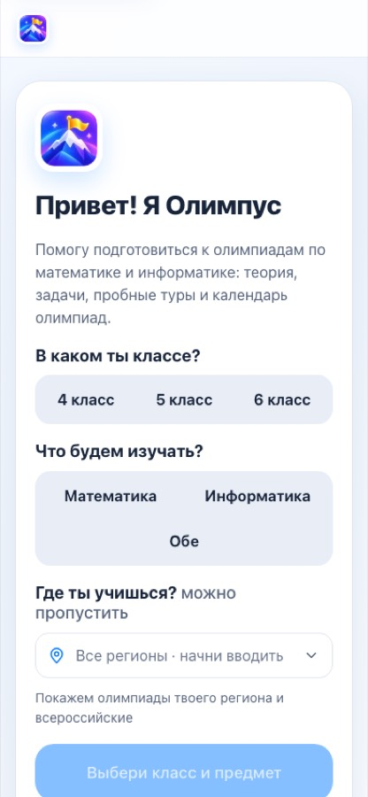
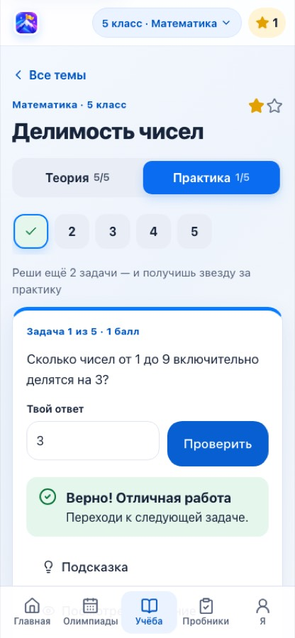
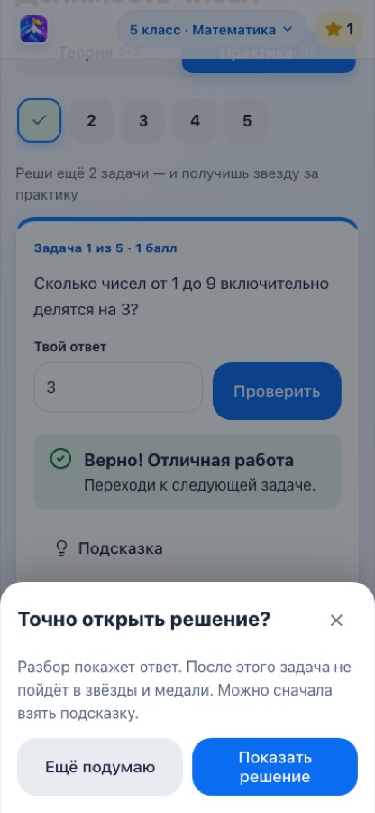
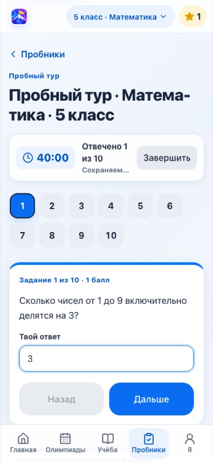

# Как пользоваться Олимпусом

Это инструкция для ученика 4–6 класса и для родителя. Здесь по шагам рассказано, что есть в
«Олимпусе», какие кнопки нажимать и что будет дальше. Названия кнопок и разделов написаны в
кавычках «так», как они выглядят в приложении.

«Олимпус» помогает готовиться к олимпиадам по математике и информатике:

- **календарь олимпиад** – какие олимпиады бывают, когда они проходят и как в них участвовать;
- **учёба** – короткие уроки и задачи по темам, за которые дают звёзды и медали;
- **пробники** – тренировочные туры на время, как на настоящей олимпиаде;
- **профиль** – твой прогресс и олимпиады, в которых ты участвуешь.

Учителю, который добавляет олимпиады и задачи, нужна другая инструкция –
[Инструкция для учителя](TEACHER-GUIDE.md). Техническое описание для проверяющих – в
[README](../README.md).

## Содержание

1. [Где открыть Олимпус](#1-где-открыть-олимпус)
2. [Первый запуск](#2-первый-запуск)
3. [Разделы приложения](#3-разделы-приложения)
4. [Главная](#4-главная)
5. [Олимпиады](#5-олимпиады)
6. [Учёба: темы, уроки и задачи](#6-учёба-темы-уроки-и-задачи)
7. [Пробники](#7-пробники)
8. [Я – профиль](#8-я--профиль)
9. [Чат-бот в MAX](#9-чат-бот-в-max)
10. [Родителям](#10-родителям)
11. [Частые вопросы](#11-частые-вопросы)
12. [Если что-то пошло не так](#12-если-что-то-пошло-не-так)

---

## 1. Где открыть Олимпус

**Удобнее всего открывать Олимпус в MAX.**

1. Открой чат-бота «Олимпуса» в MAX: https://max.ru/t605_hakaton_max_bot (ссылку можно получить и
   у учителя).
2. Нажми «Начать». Бот поздоровается и покажет кнопки.
3. Нажми «Открыть Олимпус» – приложение откроется внутри MAX.

Внутри MAX вход происходит сам, без логина и пароля. Твой прогресс привязывается к твоему
профилю MAX, поэтому его видно и на телефоне, и на компьютере.

**Можно и в обычном браузере**, по адресу сайта. Тогда ты занимаешься **как гость**: прогресс
тоже сохраняется на сервере, но он привязан к этому браузеру на этом устройстве (подробнее – в
разделе [Частые вопросы](#11-частые-вопросы)).

Как выглядит приложение:

- **на телефоне** разделы переключаются кнопками внизу экрана;
- **на компьютере** разделы находятся в колонке слева;
- светлая или тёмная тема включается сама – так же, как настроено на телефоне или компьютере.

---

## 2. Первый запуск

При первом открытии Олимпус показывает один экран: «Привет! Я Олимпус». На нём три вопроса.

| Вопрос | Что выбрать |
|---|---|
| «В каком ты классе?» | «4 класс», «5 класс» или «6 класс» |
| «Что будем изучать?» | «Математика», «Информатика» или «Обе» |
| «Где ты учишься?» (можно пропустить) | Начни вводить название региона – например, «Москва» или «Татарстан» – и выбери его из списка |

Регион нужен, чтобы в календаре были видны олимпиады именно твоего региона (а всероссийские
видны всегда). Поле понимает и короткие названия: «мск», «спб», «питер», «подмосковье»,
«кузбасс», «якутия», «хмао» и другие.

Дальше:

- кнопка «Начать» становится доступной, когда выбраны класс и предмет (до этого на ней написано
  «Выбери класс и предмет»);
- кнопка «Пропустить» откроет приложение сразу, без ответов. Тогда «Учёба» откроется для
  4 класса и математики, а календарь покажет олимпиады всех классов и предметов. Это можно
  поменять в любой момент.

*Пример экрана.*

**Как поменять класс, предмет или регион потом.** Вверху экрана есть кнопка вида
«5 класс · Математика ▾». Нажми её – откроется окно «Твой класс и предмет». Там можно выбрать
класс, предмет и регион и нажать «Готово». То же самое есть в разделе «Я» → «Мои настройки».

Выбор запоминается. Если ты вошёл через MAX, класс, предмет и регион будут те же и на
другом устройстве.

---

## 3. Разделы приложения

| Раздел | Что там |
|---|---|
| «Главная» | С чего продолжить, ближайшая олимпиада, твои олимпиады и короткая сводка прогресса |
| «Олимпиады» | Календарь олимпиад с фильтрами и карточками олимпиад |
| «Учёба» | Темы по порядку: в каждой теме теория (уроки) и практика (задачи) |
| «Пробники» | Тренировочные туры на время |
| «Я» | Профиль: настройки, мои олимпиады, достижения, медали, история пробников |

В верхней строке ещё есть:

- логотип «Олимпус» – возвращает на «Главную»;
- кнопка класса и предмета «5 класс · Математика ▾» – см. [Первый запуск](#2-первый-запуск);
- счётчик звёзд ⭐ – открывает раздел «Я».

Кнопка «Назад» (в приложении или в MAX) возвращает на предыдущий экран.

---

## 4. Главная

На «Главной» есть:

- **«Привет!»** – если ты вошёл через MAX, Олимпус поздоровается по имени.
- **Карточка «Продолжить»** (или «Начни с темы», если ты ещё не начинал). Показывает тему, в
  которой ты остановился, или следующую рекомендуемую тему, и сколько уже пройдено: например,
  «Теория 2 из 5 · задачи 1 из 5». Кнопка «Продолжить» или «Начать» откроет тему с того места, где
  ты остановился.
- **«Ближайшая олимпиада»** – олимпиада для твоего класса и региона, на которую сейчас открыта
  регистрация и у которой регистрация заканчивается раньше всех (олимпиады с пометкой
  «Рекомендуем» – первыми). Нажми на карточку, чтобы открыть подробности. Если
  регион не выбран, может появиться общая карточка олимпиады, которая проходит по регионам, с
  подписью «Выбери регион, чтобы увидеть свои даты». Если подходящих олимпиад нет, ты увидишь
  «Открытых регистраций для твоего класса сейчас нет – загляни позже».
- **«Выбери регион – покажем и региональные олимпиады»** – эта ссылка есть, пока регион не
  выбран.
- **«Все олимпиады»** – открывает весь календарь.
- **«Мои олимпиады»** – до трёх ближайших олимпиад, где ты нажал «Я участвую».
- **«Мой прогресс»** – сколько у тебя звёзд, решённых задач и медалей. Нажми, чтобы открыть
  профиль.

Если идёт пробник, над любым экраном появляется полоска «Идёт пробник · 38:12» с кнопкой
«Вернуться» – она возвращает в пробник.

---

## 5. Олимпиады

В разделе «Олимпиады» собран календарь олимпиад по математике и информатике на 2026/27 учебный
год. Даты и ссылки взяты с официальных сайтов организаторов. Внизу карточки каждой олимпиады
написано, когда её проверяли и где: например, «Проверено 29 сентября · источник: olimpiada.ru».
Организаторы иногда переносят даты, поэтому **перед участием всегда проверяй сроки на сайте
олимпиады**.

Под заголовком написано, что сейчас показано: например, «Показаны: 5 класс · математика ·
Москва и вся Россия».

### Регион

- **Регион выбран** – видны всероссийские олимпиады и олимпиады твоего региона.
- **Регион не выбран** – олимпиада, которая проходит во многих регионах в разные дни (например,
  школьный этап ВсОШ), показывается одной общей карточкой: «школьный этап · в 86 регионах · даты
  зависят от региона». На такой карточке есть кнопка «Выбрать регион».

Пока регион не выбран, вверху раздела есть карточка «Где ты учишься?» с полем «Твой регион».
Выбери регион – и Олимпус его запомнит. Кнопка «Не сейчас» прячет эту карточку.

### Фильтры

Нажми «Фильтры», чтобы открыть настройки списка:

| Фильтр | Варианты |
|---|---|
| «Класс» | «Все классы», «4 класс», «5 класс», «6 класс» |
| «Предмет» | «Все предметы», «Математика», «Информатика» |
| «Регион» | «Все регионы» или твой регион (можно начать вводить название) |
| «Как проходит» | «Онлайн и очно», «Только онлайн», «Только очно» |

Класс и регион, выбранные здесь, запоминаются как твои. Предмет и формат действуют только в
календаре. Кнопка «Сбросить» возвращает фильтры к твоим настройкам.

Если ничего не нашлось, появится «Таких олимпиад пока нет» и кнопка «Показать все олимпиады».

### Список и календарь на месяц

Справа от заголовка есть два значка: **списком** и **календарём**.

- **Список** разделён на группы:
  - «Можно зарегистрироваться»;
  - «Регистрация скоро откроется»;
  - «Даты уточняются» – организатор ещё не объявил дату;
  - «Регистрация закрыта» и «Прошедшие» – эти группы свёрнуты, их можно открыть кнопкой
    «Показать».
- **Календарь на месяц** показывает дни с отметками: «Олимпиада», «Последний день регистрации»,
  «Ты участвуешь». Нажми на день – внизу появится список олимпиад этого дня. Если в месяце
  олимпиад нет, календарь подскажет ближайшую дату. Дни олимпиад, у которых даты зависят от
  региона, появятся, когда ты выберешь регион.

### Что написано на карточке олимпиады

- предмет и классы, например «Математика · 5–6 классы»;
- значки: «Ты участвуешь» (ты отметил участие), «Рекомендуем» (учитель отметил олимпиаду как
  важную), «Пример» (это учебный пример, а не настоящая олимпиада – сейчас в календаре таких нет);
- название и этап (например, «Школьный этап»);
- строка о регистрации:

| Строка | Что значит |
|---|---|
| «Регистрация до 12 октября · осталось 13 дней» | Регистрация открыта. Когда остаётся 3 дня или меньше, строка становится оранжевой |
| «Записывает школа – спроси учителя или классного руководителя» | Отдельно регистрироваться не нужно, участников записывает школа |
| «Регистрация откроется 1 октября» | Регистрация ещё не началась |
| «Даты уточняются» / «Срок регистрации уточняется» | Организатор ещё не объявил дату |
| «Регистрация закрыта» | Срок регистрации прошёл |
| «Прошла 20 сентября» | Олимпиада уже прошла |

- дата олимпиады («Ожидается», если дата неизвестна), где проходит («Онлайн · вся Россия»,
  «Очно · Москва» и т. п.) и стоимость («Бесплатно» или цена), если она известна.

Иногда у одной олимпиады несколько направлений (профилей), например у школьного этапа ВсОШ по
информатике. Пока регион не выбран, такие направления собраны в одну карточку со списком
профилей и подсказкой «участвовать можно в одном».

### Карточка олимпиады: как участвовать

Нажми на олимпиаду – откроется её страница. На ней: «Регистрация», «Олимпиада» (дата и этап),
«Где», «Для кого», «Участие» (стоимость) и описание.

Дальше всё зависит от того, **как** на эту олимпиаду записываются.

**Если участников записывает школа** (так устроен, например, школьный этап ВсОШ):

1. Ты увидишь «Записывает школа – спроси учителя или классного руководителя. Отдельно
   регистрироваться не нужно…».
2. Кнопка «Как участвовать» открывает официальную страницу с правилами.
3. Когда ты узнал у учителя, что участвуешь, нажми «Я участвую».

**Если регистрироваться нужно самому на сайте организатора:**

1. Нажми «Зарегистрироваться на сайте» – откроется сайт олимпиады. Зарегистрируйся там
   (лучше вместе с родителем).
2. Когда вернёшься в Олимпус, он спросит «Получилось зарегистрироваться?». Нажми «Да, я
   участвую» или «Ещё нет» («Ещё нет» ничего не меняет – вернуться можно в любой момент).
3. Если регистрация у тебя уже есть, можно сразу нажать «Я участвую».

**Если регистрация закрыта**, будет кнопка «Сайт олимпиады» и подсказка. Отметить «Я участвую»
всё ещё можно – на случай, если ты зарегистрировался раньше. **Если олимпиада прошла**, остаётся
только «Сайт олимпиады».

После «Я участвую» появляется надпись «Готово! Олимпиада в твоём профиле и на главной», а на
странице олимпиады – блок «Ты участвуешь» с кнопками:

- «Сайт олимпиады» – открыть сайт организатора;
- «Готовиться» – перейти в «Учёбу»;
- «Убрать отметку» – если нажал по ошибке. Сразу после этого можно нажать «Вернуть».

> **Важно.** «Я участвую» – это отметка для тебя самого, чтобы олимпиада была в профиле и на
> главной. Она **не регистрирует** на олимпиаду у организатора. Регистрация всегда проходит на
> сайте олимпиады или через школу.

Если олимпиаду убрали из календаря, её страница скажет «Этой олимпиады больше нет в календаре» и
предложит вернуться «К олимпиадам».

---

## 6. Учёба: темы, уроки и задачи

### Список тем

В разделе «Учёба» темы твоего класса и предмета выстроены по порядку, как дорожка. Сейчас в
каждом классе по 12 тем по математике и 12 тем по информатике, а в каждой теме – 5 уроков и
5 задач.

- Вверху написано, сколько тем и звёзд: например, «5 класс · 12 тем · 3 звезды из 24».
- Переключатель «Математика» / «Информатика» меняет предмет.
- Карточка «Следующая тема» (или «Продолжай») подсказывает, что делать дальше, например «Начни с
  теории: 5 уроков, потом задачи». Кнопка «Начать» или «Продолжить» открывает тему.
- Поле «Найти тему» ищет тему по названию.
- На дорожке у каждой темы две звёздочки и счётчики «теория 2/5 · задачи 1/5».

### Как устроена тема

У каждой темы есть две части и **две звезды**:

| Часть | Как получить звезду |
|---|---|
| «Теория» – уроки | Прочитать **все** уроки темы |
| «Практика» – задачи | **Самому** решить 3 задачи этой темы (без открытого решения) |

Переключатель «Теория 2/5» / «Практика 1/5» показывает, сколько пройдено. Кнопка «Все темы»
возвращает к списку. Олимпус запоминает, где ты остановился, и открывает тему с первого
непрочитанного урока или первой нерешённой задачи.

### Теория (уроки)

- Кружки с цифрами – уроки темы; прочитанные отмечены галочкой. На них можно нажимать в любом
  порядке.
- В уроке бывают текст, примеры с разбором, списки, таблицы, формулы и кусочки кода.
- Урок считается прочитанным, когда ты долистал до конца и задержался там на пару секунд, или
  когда нажал «Дальше».
- На последнем уроке кнопка называется «Завершить теорию». Если какой-то урок пропущен, Олимпус
  подскажет: «Чтобы получить звезду, открой урок 2 и урок 4».
- Когда прочитаны все уроки, звезда за теорию выдаётся сама: «Звезда за теорию! ⭐» и «Теория
  пройдена!». Кнопка «К практике» ведёт к задачам.

### Практика (задачи)

Над задачей написано, сколько осталось до звезды: «Реши ещё 3 задачи – и получишь звезду за
практику». Кружки с цифрами – задачи темы, решённые отмечены галочкой.

**Задача с ответом-числом** (таких большинство):

1. Прочитай условие. Вверху видно номер и баллы: «Задача 1 из 5 · 1 балл».
2. Впиши ответ в поле «Твой ответ» и нажми «Проверить». Можно писать целые и дробные числа:
   `12`, `-3`, `0,5` или `0.5`.
3. Ответ: «Верно! Отличная работа» или «Пока неверно. Попробуй ещё раз или возьми подсказку».
   Пробовать можно сколько угодно раз.

*Пример экрана.*

**Подсказка и решение:**

- «Подсказка» показывает наводящую мысль. Подсказка **не мешает** получить звезду.
- «Посмотреть решение» показывает ответ и разбор. Сначала Олимпус переспросит: «Точно открыть
  решение?» – кнопки «Показать решение» и «Ещё подумаю».
- Если открыть решение **до того, как решил сам**, эта задача уже не пойдёт в звёзды и медали,
  даже если потом ввести верный ответ. Олимпус так и напишет: «Задача решена после разбора – она
  не идёт в звёзды и медали, но потренироваться полезно». Задача, которую ты уже решил сам,
  остаётся засчитанной, даже если потом посмотреть разбор.

*Пример экрана.*

Когда набрано 3 своих решения, появится «Звезда за практику! ⭐» и «Тема закреплена!», а на
последней задаче – кнопка «Следующая тема». Решать дальше тоже полезно: каждая своя задача
приближает медаль. Уже решённую задачу можно решить ещё раз.

**Задача на рассуждение** (если учитель добавит такую): решение записывают на бумаге. Потом нажми
«Открыть решение и проверить себя», сравни и честно выбери «У меня так же» или «Есть ошибка».

**Задача с программой** (в информатике):

1. В поле «Код программы» напиши программу. Язык выбирается в списке: Python, Pascal, C++, Java,
   JavaScript или Kotlin.
2. Код **сохраняется сам** – под полем видно «Код сохраняется автоматически» / «Код сохранён».
   Можно закрыть задачу и вернуться позже.
3. «Пример входа» и «Пример выхода» показывают, какие данные получит программа и что она должна
   вывести.
4. «Запустить» – запускает программу на данных из поля «Входные данные (можно изменить)».
   Результат появится в поле «Результат». Это просто проба, она не засчитывает задачу.
5. «Проверить» – проверяет программу на скрытых тестах. Ответ: «Все тесты пройдены» или «Есть
   тесты, которые не прошли».

Программы проверяет отдельный сервер проверки. Если он сейчас не работает, Олимпус пишет:
«Проверка программ сейчас не работает. Твой код сохранён – попробуй позже, а пока можно решать
задачи с ответом-числом». Код при этом не теряется, а разбор решения («Посмотреть решение»)
доступен.

Пока идёт пробник, подсказки и решения к задачам из этого пробника закрыты: «Подсказки и решения
откроются, когда ты закончишь пробник».

---

## 7. Пробники

Пробник – тренировочный тур на время, как настоящая олимпиада: таймер, несколько заданий, а
ответы и разборы – только после финиша.

### Какие пробники есть

Сейчас в Олимпусе 12 пробников – по два на каждый класс и предмет:

| Пробник | Время | Заданий |
|---|---|---|
| «Пробный тур по математике» (4, 5, 6 класс) | 60 минут | 10 |
| «Пробный тур по информатике» (4, 5, 6 класс) | 75 минут | 9 |
| «Большой тур по математике» / «…по информатике» (4, 5, 6 класс) | 60 минут | 12, каждый раз новые – выбираются из 60 |

Фильтры вверху: «Класс», «Предмет» («Оба предмета», «Математика», «Информатика») и «Олимпиада»
(«Пробный тур Олимпуса» или «Большой тур Олимпуса»). На карточке пробника видно лучший результат,
например «Лучший результат: 7 из 10 баллов · 2 попытки», и кнопка «Начать пробник», «Продолжить»
или «Пройти ещё раз».

### Начало

Нажми «Начать пробник». Откроется окно «Готов к пробнику?» с правилами:

- сколько заданий и минут;
- «Таймер не остановится, даже если закрыть приложение»;
- «Ответы и разборы откроются сразу после финиша».

Кнопка «Начать» запускает таймер, «Позже» – закрывает окно.

### Во время пробника

- Вверху – таймер и счётчик «Отвечено 3 из 10». Когда останется 5 минут и 1 минута, Олимпус
  предупредит («Осталось 5 минут», «Осталась 1 минута! Проверь ответы»).
- Ответы **сохраняются сами** – рядом написано «Ответы сохранены». Если пропал интернет:
  «Нет связи – ответы сохраним, когда связь вернётся».
- Кружки с номерами – задания; решай в любом порядке. Кнопки «Назад» и «Дальше» листают задания.
- Ответ пишут так:
  - число – в поле «Твой ответ» (если ввести не число, Олимпус предупредит: «Нужно число,
    например 12 или 0,5 – иначе ответ не засчитается»);
  - программу – в поле «Твоя программа» с выбором языка;
  - рассуждение – в поле «Твоё рассуждение».
- Подсказок и разборов во время пробника нет.

*Пример экрана.*

**Если нужно выйти.** Олимпус спросит «Выйти из пробника?»: таймер продолжит идти, ответы
сохранены. Кнопки «Выйти» и «Остаться». Пока пробник идёт, на всех экранах видна полоска «Идёт
пробник · 38:12» с кнопкой «Вернуться». В MAX при попытке закрыть приложение тоже появится
вопрос. Вернуться в пробник можно и из раздела «Пробники» – кнопка «Продолжить».

**Как закончить.** Нажми «Завершить». Олимпус переспросит «Завершить пробник?» и напомнит, сколько
заданий с ответом: после завершения ответы изменить нельзя. Кнопки «Завершить» и «Ещё порешаю».
Когда время выходит, пробник завершается сам: «Время вышло – пробник завершён. Смотри результат».
Если время закончилось, пока приложение было закрыто, при следующем открытии пробника он
завершится и покажет результат по сохранённым ответам.

### Результаты

После финиша открывается «Результат пробника»:

- сколько баллов из скольких и процент, дата и время;
- «Разобрать ошибки» – открывает практику по теме, где была первая ошибка;
- «К пробникам» – вернуться к списку;
- «Поделиться результатом» – отправить результат в чат MAX (кнопка есть только внутри MAX).

Ниже – «Разбор заданий». У каждого задания есть отметка «Верно», «Неверно», «Не проверено» или
«Самопроверка», баллы, «Твой ответ», «Правильный ответ» (для задач с числом) и «Разбор».

- **«Самопроверка»** – у заданий на рассуждение. Сравни своё рассуждение с разбором и нажми «Моё
  рассуждение верное» или «Есть ошибка» – баллы пересчитаются.
- **«Не проверено»** – у программ, если сервер проверки был недоступен. Баллы за них добавятся
  позже: нажми «Проверить ещё раз», когда проверка снова заработает.

Пробники нужны, чтобы потренироваться в темпе олимпиады. Звёзды и медали за них не выдаются –
они даются за задачи в «Учёбе». Результаты всех попыток видны в разделе «Я» → «История
пробников».

---

## 8. Я – профиль

- **Вверху** – твоё имя из MAX и «Вход через MAX · прогресс на всех устройствах». Если ты
  занимаешься без MAX, там написано «Гость» и «Гостевой режим», а ниже – карточка «Ты
  занимаешься как гость» с объяснением. Если Олимпус открыт в браузере и на сервере настроен вход
  через MAX, в карточке есть кнопка «Открыть в MAX».
- **«Мои настройки»** – «Класс и предмет» и «Мой регион».
- **«Мои олимпиады»** – все олимпиады, где ты нажал «Я участвую», с датами. Прошедшие помечены
  «прошла» и тоже остаются здесь. Кнопки «Открыть» и «Убрать» (после «Убрать» можно нажать
  «Вернуть»).
- **«Достижения»** – сколько у тебя звёзд за темы, решённых задач и медалей.
- **«Медали»** – отдельно по математике и по информатике (подробнее – ниже).
- **«Звёзды за темы»** – список полученных звёзд: название темы и «теория» или «практика».
- **«История пробников»** – все попытки с датой и результатом («7 из 10»). Идущая попытка
  помечена «Идёт», а попытка, у которой вышло время, – «Завершается». Нажми на попытку, чтобы
  открыть её результат или вернуться в неё.
- **«О приложении»** – «Об Олимпусе» (возрастная категория 6+ и контакты), «Политика
  конфиденциальности», «Условия использования». Те же ссылки есть внизу каждой страницы.
- **«Для учителя»** – неприметная кнопка в самом низу. Это вход для учителя по паролю, детям
  она не нужна. Как ей пользоваться, написано в [инструкции для учителя](TEACHER-GUIDE.md).

### Медали

Медали дают за задачи, решённые **самостоятельно** (без открытого решения) в «Учёбе». Их
считают отдельно по каждому предмету, поэтому всего можно собрать 10 медалей – по 5 на
математику и на информатику.

| Медаль | Сколько задач решить по предмету |
|---|---|
| «Первый шаг» | 1 |
| «Исследователь» | 5 |
| «Мыслитель» | 15 |
| «Мастер» | 30 |
| «Олимпиец» | 60 |

Под медалями написано, сколько осталось до следующей, например «Ещё 3 задачи до медали
«Исследователь»». Когда собраны все пять – «Все медали собраны!».

---

## 9. Чат-бот в MAX

Чат-бот – вход в Олимпус внутри MAX. В чате можно посмотреть ближайшие олимпиады и свой прогресс,
а заниматься – в приложении, которое открывается кнопкой из чата.

Когда ты нажимаешь «Начать», бот здоровается и показывает кнопки:

| Кнопка | Что делает |
|---|---|
| «Открыть Олимпус» | Открывает приложение |
| «Ближайшие олимпиады» | До 5 ближайших олимпиад с датой, предметом, форматом и регистрацией. Нажми на олимпиаду – откроется её карточка в приложении |
| «Мой прогресс» | Звёзды, решённые задачи, медали, результат последнего пробника и «Мои олимпиады» |
| «Как это работает» | Коротко: что делать ребёнку и что важно знать родителям |

Кнопка «Меню» возвращает к главным кнопкам.

Боту можно писать команды или простые слова:

| Команда | Или слово | Что делает |
|---|---|---|
| `/start` | «меню», «старт», «начать», «привет» | Приветствие и кнопки |
| `/calendar` | «календарь», «олимпиады», «ближайшие олимпиады» | Ближайшие олимпиады |
| `/progress` | «прогресс», «мой прогресс» | Твой прогресс и олимпиады |
| `/reminders` | «напоминания» | Напоминания об олимпиадах |
| `/help` | «помощь», «помоги» | Список команд |

Что важно знать:

- Бот подбирает олимпиады по классу и региону, которые ты выбрал в приложении. Если они не
  выбраны, бот покажет всероссийские олимпиады.
- Бот видит прогресс, только если ты открывал приложение **через этого бота** (то есть вошёл
  через MAX). Гостевой прогресс из обычного браузера бот не видит.
- Бот понимает только команды и кнопки. На обычные сообщения он отвечает подсказкой – написать
  человеку через него нельзя.
- **Напоминания пока выключены.** Правила MAX разрешают боту присылать такие сообщения только по
  договорённости с MAX, поэтому до неё команда `/reminders` отвечает, что напоминания ещё не
  включены, и советует смотреть сроки в «Моих олимпиадах». Когда напоминания включат, бот будет
  писать только тем, кто сам нажмёт «Включить напоминания», и только об олимпиадах из «Моих
  олимпиад»: за 3 дня и накануне, с 10:00 до 20:00 по Москве. Выключить можно кнопкой «Не
  напоминать» или «Выключить напоминания».

Подробное техническое описание бота – в [BOT.md](BOT.md).

---

## 10. Родителям

- **Что делает ребёнок.** Читает короткие уроки, решает задачи с мгновенной проверкой, проходит
  пробные туры на время и ведёт свой список олимпиад.
- **Как посмотреть прогресс.** Раздел «Я» в приложении или команда `/progress` в чате с ботом –
  с профиля MAX ребёнка: бот показывает прогресс того, кто ему пишет.
- **Регистрация на олимпиады** проходит только на сайте организатора или через школу. Олимпус
  показывает, где и до какого числа регистрироваться, но сам никуда не записывает. Отметка «Я
  участвую» – напоминание для ребёнка, а не заявка.
- **Даты** сверены с официальными сайтами (дата проверки и источник написаны на странице
  олимпиады), но организаторы могут их менять. Перед олимпиадой проверьте сроки на сайте
  организатора.
- **Чего в Олимпусе нет:** рекламы, платных функций, переписки с другими людьми. Бот не
  спрашивает телефон.
- **Какие данные сохраняются** – см. вопрос [«Какие данные о ребёнке хранятся?»](#какие-данные-о-ребёнке-хранятся).

---

## 11. Частые вопросы

### Что будет с прогрессом, если…

| Если… | Что будет |
|---|---|
| закрыть приложение или обновить страницу | Ничего не пропадёт: уроки, задачи, звёзды, код, ответы пробников и отметки «Я участвую» хранятся на сервере |
| открыть Олимпус через MAX на другом телефоне или компьютере | Всё будет на месте: прогресс привязан к твоему профилю MAX |
| переустановить MAX или сменить телефон | Прогресс сохранится – он на сервере, а не в телефоне. Открой Олимпус через бота, и вход произойдёт сам |
| сменить класс или предмет | Ничего не потеряется. Просто покажутся темы и пробники другого класса или предмета; к прежним можно вернуться |
| заниматься в обычном браузере без MAX (как гость) | Прогресс хранится на сервере, но открыть его можно только из этого браузера на этом устройстве. Гостевой сеанс действует год с первого захода |
| очистить данные браузера или открыть другой браузер | В гостевом режиме доступ к прогрессу будет потерян – начнётся новый гостевой профиль. С входом через MAX ничего не теряется |
| сначала заниматься как гость, а потом войти через MAX | Гостевой прогресс переносится в профиль MAX, если вход через MAX произошёл **в том же окне**, где ты занимался как гость (например, когда вход в MAX сначала не удался, а потом получился). Прогресс из другого браузера или другого устройства сам не переносится |
| учитель исправил или убрал тему, задачу или олимпиаду | Полученные звёзды, решённые задачи и медали остаются. Убранные материалы просто исчезнут из списков |

**Совет:** открывай Олимпус через чат-бота в MAX – тогда прогресс точно не потеряется и будет
одинаковым на всех устройствах.

### Почему не проверяется моя программа?

Программы проверяет отдельный сервер проверки. Если он выключен или перегружен, Олимпус пишет
«Проверка программ сейчас не работает…». Твой код при этом сохранён – попробуй позже, а пока
реши задачи с ответом-числом или посмотри разбор. В пробнике такие задания получат отметку «Не
проверено», и их можно будет проверить позже кнопкой «Проверить ещё раз».

### Почему мне не дали звезду за задачу?

- Звезда за практику даётся за **3 задачи темы, решённые самостоятельно**.
- Задача не засчитывается, если решение открыли **до** того, как решили сам.
- Задания в пробниках не дают звёзд и медалей – только баллы пробника.
- Звезда за теорию даётся, когда прочитаны **все** уроки темы. Если один урок пропущен, Олимпус
  подскажет, какой.

### «Я участвую» – это регистрация на олимпиаду?

Нет. Это отметка для тебя: олимпиада появится на главной и в профиле, а бот будет видеть её в
«Моих олимпиадах». Регистрироваться нужно на сайте организатора (кнопка «Зарегистрироваться на
сайте») или через школу, если написано «Записывает школа».

### Почему у олимпиады «Ожидается» или «Даты уточняются»?

Организатор ещё не объявил дату. Такие олимпиады собраны в группе «Даты уточняются». Когда даты
появятся на официальном сайте, их добавят в календарь.

### Почему я не вижу олимпиаду своего региона?

Проверь, что в фильтре «Регион» выбран твой регион, а класс и предмет не слишком узкие («Все
классы», «Все предметы»). Всероссийские олимпиады видны всегда. Если олимпиады нет в календаре,
её пока не добавили – спроси учителя.

### Какие данные о ребёнке хранятся?

- **Учебные данные:** прочитанные уроки, звёзды, ответы и код, результаты и время пробников,
  отметки «Я участвую», выбранные класс, предмет и регион.
- **При входе через MAX:** идентификатор пользователя MAX и имя из профиля MAX (им Олимпус
  здоровается). Чат-бот дополнительно хранит имя для приветствия, время начала и остановки
  диалога и согласие на напоминания.
- **В гостевом режиме:** случайный идентификатор сеанса в cookie браузера или во временном
  хранилище вкладки.
- **В самом браузере** (чтобы открыть приложение с того же места): класс, предмет, регион и
  последняя открытая тема.
- **Не сохраняются:** фотография профиля, телефон, возраст, домашний адрес. Бот не хранит
  тексты сообщений.

Данные хранятся на сервере Олимпуса. Сам идентификатор сеанса сервер не хранит – только его
необратимый «отпечаток» (хеш), поэтому даже копия базы данных не позволяет войти под чужим
профилем. Если ребёнок решает задачу с программой, код отправляется на сервер проверки.
Удалить или уточнить данные можно по запросу через контакты в разделе «Я» → «Об Олимпусе».
Полный текст – в «Политике конфиденциальности» внутри приложения. Технические подробности – в
[DATA.md](DATA.md) и [SECURITY.md](SECURITY.md).

Не пишите в ответах и в коде пароли, телефоны и другие личные сведения – они там не нужны.

### Где взять помощь?

- «Я» → «Об Олимпусе» – там указаны контакты поддержки.
- С вопросами про конкретную олимпиаду – на сайт организатора (ссылка есть на странице
  олимпиады) или к учителю.
- Чат-бот понимает только команды и кнопки и не пересылает сообщения людям.

---

## 12. Если что-то пошло не так

При ошибке Олимпус пишет, что случилось и что делать. Самые частые сообщения:

| Сообщение | Что делать |
|---|---|
| «Не получилось загрузить Олимпус» | Проверь интернет и нажми «Попробовать ещё раз» |
| «Нет связи с сервером…» / «Похоже, пропал интернет…» | Подключись к интернету и повтори действие |
| «Сервер долго не отвечает. Попробуй ещё раз через минуту» | Подожди минуту и повтори |
| «Сеанс закончился. Закрой Олимпус и открой снова – прогресс сохранён» | Закрой приложение и открой снова (в MAX – из чата с ботом) |
| «Не получилось войти через MAX… Пока занимаемся как гость» | Закрой Олимпус и открой его снова из чата с ботом |
| «Вход через MAX пока не настроен. Прогресс сохраняется на этом устройстве» | Вход через MAX на этом сервере не включён – можно заниматься как гость |
| «Проверка программ сейчас не работает…» | Код сохранён, проверь позже. См. [вопрос выше](#почему-не-проверяется-моя-программа) |
| «Подсказки и решения откроются, когда ты закончишь пробник» | Сначала заверши пробник |
| «Нужно число, например 12 или 0,5» | В ответ нужно вписать только число |
| «Не нашли этот материал. Возможно, его убрали» | Учитель убрал материал – выбери другой из списка |
| «Этой олимпиады уже нет в календаре. Посмотри другие» | Олимпиаду убрали из календаря – выбери другую |
| «На сервере что-то пошло не так. Попробуй ещё раз через минуту» | Повтори позже. Если не помогло – напиши в поддержку |

Если ответы в пробнике не сохранились из-за связи («Нет связи – ответы сохраним, когда связь
вернётся»), не закрывай пробник, пока нет интернета. Когда связь вернётся, Олимпус снова
отправит ответы – при следующем изменении ответа, при выходе из пробника или при нажатии
«Завершить» (вместе с завершением отправляются все ответы). Код в задачах с программой
сохраняется так же: «Не сохранилось – попробуем ещё раз при следующем изменении».
